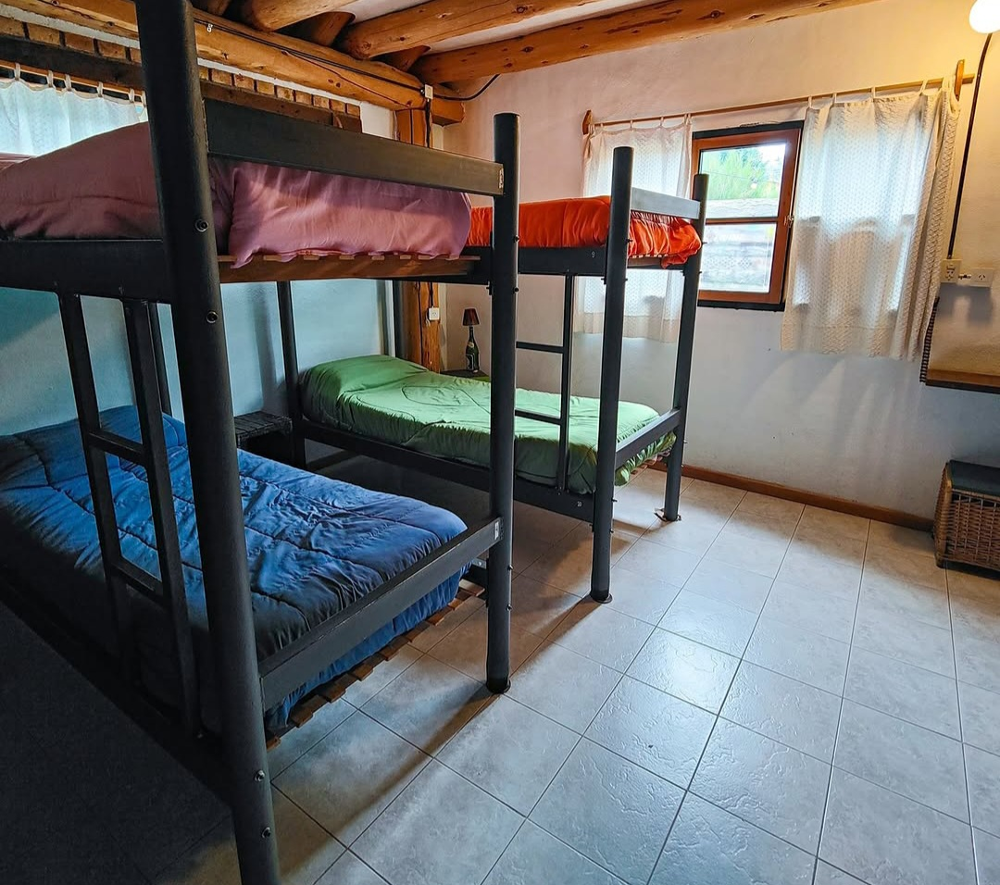

# El Italian Hostel — hostelitalian-vanilla

Sitio web del Hostel El Italian, Villa La Angostura, Patagonia.
Stack: HTML / SCSS / JS (ES Modules).

---

## Estructura

```
hostelitalian-vanilla/
├── scss/
│   ├── main.scss          ← entry point SCSS (compilar este archivo)
│   ├── _variables.scss    ← paleta, tipografías, breakpoints
│   ├── _base.scss         ← reset, .container, tipografía base
│   ├── _navbar.scss       ← navbar fija + mobile menu
│   ├── _hero.scss         ← hero fullscreen (home)
│   ├── _sections.scss     ← galería, rooms, servicios
│   ├── _bottom.scss       ← reservas, location, reviews, footer
│   ├── _utilities.scss    ← helpers (.fade-up, sr-only, etc.)
│   └── pages/              ← estilos específicos por página interna
│       ├── _shared.scss    ← page-hero y cta-strip (compartidos)
│       ├── _habitaciones.scss
│       ├── _servicios.scss
│       ├── _ubicacion.scss
│       ├── _resenas.scss
│       └── _reservar.scss  ← wizard de reservas + calendario
├── css/
│   └── main.css            ← COMPILADO. No editar a mano: se pisa en cada build.
├── js/
│   ├── main.js              ← entrada: partials, navbar, animaciones, precios, contacto
│   ├── reservation.js       ← wizard de reservas (3 pasos)
│   ├── calendar.js          ← componente de calendario visual (accesible por teclado)
│   └── storage.js           ← persistencia en localStorage + reglas de disponibilidad
├── partials/
│   ├── header.html
│   └── footer.html
├── img/
│   ├── webp/                ← versiones optimizadas de las imágenes en uso
│   └── (originales .jpg/.png/.webp)
├── index.html
├── habitaciones.html
├── servicios.html
├── ubicacion.html
├── resenas.html
├── reservar.html             ← wizard de reservas
├── favicon.svg
├── robots.txt
├── sitemap.xml
└── README.md
```

> ⚠️ **Importante:** el código fuente de estilos vive en `/scss`. El archivo  `css/main.css` es el resultado compilado — **nunca se edita a mano**, porque cualquier cambio manual ahí se pierde en el próximo build. Si necesitás un fix de compatibilidad (ej. un prefijo `-webkit-`), va siempre en el `.scss` correspondiente.

---

## Compilar SCSS

```bash
# Instalar Sass globalmente (una sola vez)
npm install -g sass

# Compilar con watch (mientras desarrollás)
sass scss/main.scss css/main.css --watch

# Compilar una vez, para producción (minificado)
sass scss/main.scss css/main.css --style=compressed
```

---

## Servir localmente

Los módulos JS (`type="module"`) requieren un servidor HTTP.
No abrir los HTML directamente con `file://`.

```bash
# Con Node.js
npx serve .

# Con Python
python3 -m http.server 3000
```

---

## Imágenes

Solo las imágenes que aparecen referenciadas en los `.html` y en `/scss`
están realmente en uso por el sitio — el resto de los archivos sueltos en
`/img` son material de descarte de iteraciones anteriores y se pueden
borrar sin afectar nada (revisar antes por si alguno se reserva para una
futura sección de "qué hacer en la zona").

Las imágenes en uso tienen una versión optimizada en `/img/webp`, servida
mediante `<picture>` con fallback a `.jpg` para máxima compatibilidad:

```html
<picture>
  <source srcset="img/webp/habcompartida.webp" type="image/webp" />
  
</picture>
```

Si agregás una imagen nueva, conviene generar su versión `.webp` con la
misma convención (`npx sharp-cli` o Squoosh) y envolver el `` en
`<picture>` siguiendo el mismo patrón.

---

## Sistema de reservas

El sistema guarda las reservas en `localStorage` del navegador del usuario.
**No hay backend ni notificación server-side todavía** — para uso real con
volumen de reservas, hay que migrar `storage.js` a una API REST propia o a
un servicio como Firebase/Supabase, y agregar una notificación automática
al hostel (email o WhatsApp Business API) en el momento en que se guarda
la reserva.

### Cómo se notifica el hostel hoy

Al hacer clic en **"Confirmar y enviar por WhatsApp"**, el sistema:
1. Guarda la reserva en `localStorage`.
2. Abre automáticamente WhatsApp con el mensaje pre-armado, dirigido al
   número configurado en `waNumber`.
3. Si el navegador bloquea el popup, queda un botón de respaldo visible en
   la pantalla de éxito para reenviarlo manualmente.

Esto reemplaza el comportamiento anterior, donde "confirmar" solo guardaba
localmente y el usuario podía cerrar la página sin que el hostel se
enterara nunca de la reserva.

### Configurar precios, capacidad y contacto

En `js/storage.js`, modificar `DEFAULT_CONFIG`:

```js
const DEFAULT_CONFIG = {
  prices: {
    dorm:    25000,   // ARS por noche por persona
    private: 65000,   // ARS por noche
  },
  capacity: {
    dorm:    8,        // camas totales del dormitorio compartido
    private: 1,        // unidades de la habitación privada
  },
  waNumber:     '5492944000000',         // Número real sin + ni espacios
  contactEmail: 'hola@hostelitalian.com', // Email real de contacto
  ...
};
```

Los precios mostrados en `habitaciones.html` y `reservar.html` se pintan
dinámicamente desde esta misma configuración (atributo `data-price="dorm"`
o `data-price="private"`) — **no hace falta editar el HTML** cuando cambia
un precio.

### Capacidad del dormitorio

La disponibilidad del dormitorio compartido se calcula por huéspedes
ocupados vs. camas totales (`capacity.dorm`), no por "una reserva = todo
bloqueado". Varias reservas distintas pueden convivir en las mismas fechas
mientras queden camas libres.

---

## Pendiente antes de producción

- [ ] Reemplazar todos los placeholders (`waNumber`, `contactEmail`,
      dirección, teléfono del footer) por los datos reales del hostel.
- [ ] Conectar el formulario de contacto y la confirmación de reserva a un
      canal server-side real (hoy dependen de que el navegador del usuario
      pueda abrir `mailto:` / WhatsApp).
- [ ] Reemplazar `https://hostelitalian.com` en `sitemap.xml`, `robots.txt`
      y las etiquetas `canonical`/`og:url` por el dominio real una vez
      que esté en producción.
